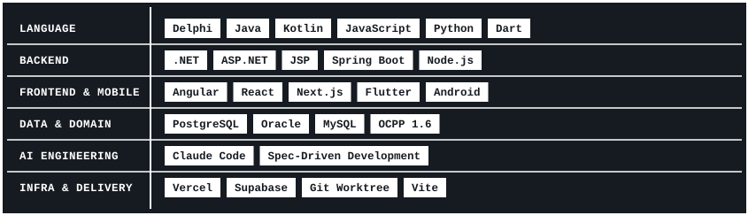
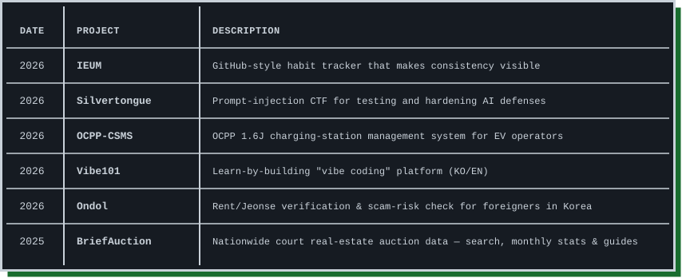
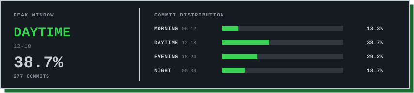

<!-- ===================== TYPING ===================== -->
<picture>
  <source media="(prefers-color-scheme: dark)"  srcset="./output/banner-dark.svg">
  <source media="(prefers-color-scheme: light)" srcset="./output/banner-light.svg">
  
</picture>

 
 

<!-- ===================== TECH STACK ===================== -->
<picture>
  <source media="(prefers-color-scheme: dark)"  srcset="./output/title-techstack-dark.svg">
  <source media="(prefers-color-scheme: light)" srcset="./output/title-techstack-light.svg">
  
</picture>

<picture>
  <source media="(prefers-color-scheme: dark)"  srcset="./output/techstack-dark.svg">
  <source media="(prefers-color-scheme: light)" srcset="./output/techstack-light.svg">
  
</picture>

 

<!-- ===================== PROJECTS ===================== -->
<picture>
  <source media="(prefers-color-scheme: dark)"  srcset="./output/title-products-dark.svg">
  <source media="(prefers-color-scheme: light)" srcset="./output/title-products-light.svg">
  
</picture>

<picture>
  <source media="(prefers-color-scheme: dark)"  srcset="./output/products-dark.svg">
  <source media="(prefers-color-scheme: light)" srcset="./output/products-light.svg">
  
</picture>

🔗&nbsp; <a href="https://vibe101.dev">Vibe101</a> &nbsp;·&nbsp; <a href="https://ondolkorea.com">Ondol</a> &nbsp;·&nbsp; <a href="https://briefauction.com">BriefAuction</a>

 

<!-- ===================== PRODUCTIVE TIME (auto-updated) ===================== -->
<picture>
  <source media="(prefers-color-scheme: dark)"  srcset="./output/title-active-dark.svg">
  <source media="(prefers-color-scheme: light)" srcset="./output/title-active-light.svg">
  
</picture>

<!-- PRODUCTIVE-TIME:START -->

<picture>
  <source media="(prefers-color-scheme: dark)"  srcset="./output/productive-dark.svg">
  <source media="(prefers-color-scheme: light)" srcset="./output/productive-light.svg">
  
</picture>

<!-- PRODUCTIVE-TIME:END -->

 

<!-- ===================== STREAK (auto-updated) ===================== -->
<picture>
  <source media="(prefers-color-scheme: dark)"  srcset="./output/title-streak-dark.svg">
  <source media="(prefers-color-scheme: light)" srcset="./output/title-streak-light.svg">
  
</picture>

<picture>
  <source media="(prefers-color-scheme: dark)"  srcset="./output/streak-dark.svg">
  <source media="(prefers-color-scheme: light)" srcset="./output/streak-light.svg">
  
</picture>
