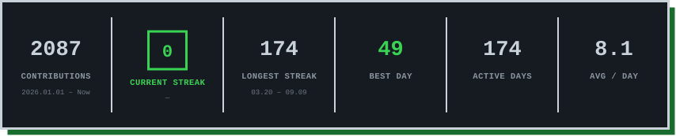

<!-- ===================== TYPING ===================== -->
<div align="center">


</div>

<br/>

<!-- ===================== TECH STACK ===================== -->
<h3 align="left">🛠️ Tech Stack</h3>

<table>
  <tr>
    <td align="center"><b>Language</b></td>
    <td>
      
      
      
      
      
      
    </td>
  </tr>
  <tr>
    <td align="center"><b>Backend</b></td>
    <td>
      
      
      
      
      
    </td>
  </tr>
  <tr>
    <td align="center"><b>Frontend &amp; Mobile</b></td>
    <td>
      
      
      
      
      
    </td>
  </tr>
  <tr>
    <td align="center"><b>Data &amp; Domain</b></td>
    <td>
      
      
      
      
    </td>
  </tr>
  <tr>
    <td align="center"><b>AI Engineering</b></td>
    <td>
      
      
      
      
      
    </td>
  </tr>
  <tr>
    <td align="center"><b>Infra &amp; Delivery</b></td>
    <td>
      
      
      
      
    </td>
  </tr>
</table>

<br/>

<!-- ===================== PROJECTS ===================== -->
<h3 align="left">🚀 10m2's Products</h3>

| Date | Project | Description | Links |
|:-:|:-|:-|:-:|
| <sub>2026</sub> | **🧑‍💻 Vibe101** | Learn-by-building "vibe coding" platform (KO/EN) | [🔗](https://vibe101.dev) |
| <sub>2026</sub> | **🏠 Ondol** | Rent/Jeonse verification & scam-risk check for foreigners in Korea | [🔗](https://ondolkorea.com) |
| <sub>2025</sub> | **⚖️ BriefAuction** | Nationwide court real-estate auction data — search, monthly stats & guides | [🔗](https://briefauction.com) |

<br/>

<!-- ===================== PRODUCTIVE TIME (text, auto-updated) ===================== -->
<h3 align="left">🕐 When am I most active?</h3>

<!-- PRODUCTIVE-TIME:START -->

```text
1     🌅    Morning     06-12       84 commits      ███·················    17.0%
2     🌞    Daytime     12-18      205 commits      ████████············    41.5%
3     🌆    Evening     18-24       97 commits      ████················    19.6%
4     🌙    Night       00-06      108 commits      ████················    21.9%
```

<!-- PRODUCTIVE-TIME:END -->

<br/>

<!-- ===================== STREAK (image, auto-updated) ===================== -->
<h3 align="left">🔥 Commit Streak</h3>

<picture>
  <source media="(prefers-color-scheme: dark)"  srcset="./output/streak-dark.svg">
  <source media="(prefers-color-scheme: light)" srcset="./output/streak-light.svg">
  
</picture>
